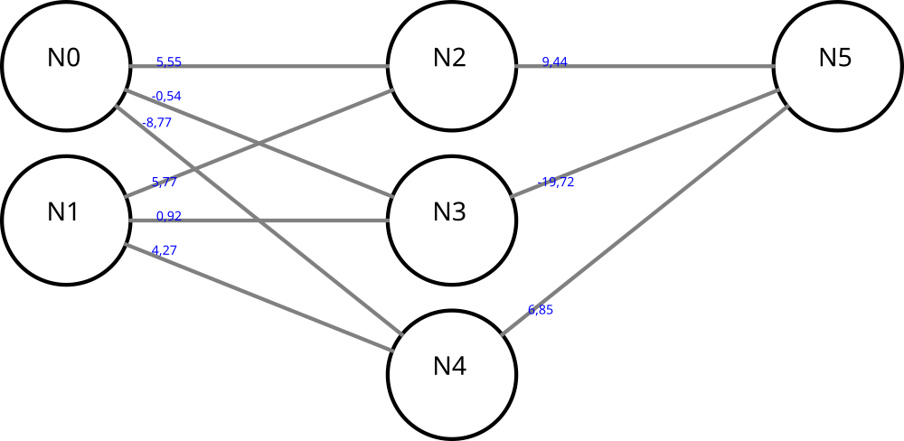

# neural


My multi-layer perceptron back propagation implementation.
[(source)](https://mattmazur.com/2015/03/17/a-step-by-step-backpropagation-example/)

# xor sample


## define network and train

```java
// Defining a XOR network
network = new Network();

// Layers
Layer l0 = Network.createLayer(network, 2, 0.0f);
Layer l1 = Network.createLayer(network, 3, 0.0f);
Layer l2 = Network.createLayer(network, 1, 0.0f);

// Layers connection
Network.connectLayers(network, l0, l1);
Network.connectLayers(network, l1, l2);

// Add layers on network
network.addLayer(l0);
network.addLayer(l1);
network.addLayer(l2);

// Random weights
network.xavierInitWeights();

// Define sets
double[][] inputs = { { 0, 0 }, { 0, 1 }, { 1, 0 }, { 1, 1 } };
double[][] outputs = { { 0 }, { 1 }, { 1 }, { 0 } };
network.setInputs(inputs);
network.setExpectedOutputs(outputs);

// train
network.setLearningRate(0.1);
long st = System.currentTimeMillis();
int epochs = network.train(20000, 0.000000005);
long et = System.currentTimeMillis();
Log.info("epochs:" + epochs + " in " + (et - st));
```
## predictions
```java
// tests
Network trainedNetwork = Network.copy(network, true);
Log.info("error:" + String.format("%.10f", network.getTotalError()));

network = trainedNetwork;
double[] inputTest = inputs[0];
double result[] = Network.predict(network, inputTest);
Network.displayResult(inputTest, result);

network = trainedNetwork;
inputTest = inputs[1];
result = Network.predict(network, inputTest);
Network.displayResult(inputTest, result);

network = trainedNetwork;
inputTest = inputs[2];
result = Network.predict(network, inputTest);
Network.displayResult(inputTest, result);

network = trainedNetwork;
inputTest = inputs[3];
result = Network.predict(network, inputTest);
Network.displayResult(inputTest, result);
```

## results
```
[0,000][0,000] -> [0,153]
[0,000][1,000] -> [0,887]
[1,000][0,000] -> [0,895]
[1,000][1,000] -> [0,099]
```

# Tested on [MNIST](http://yann.lecun.com/exdb/mnist/) dataset
The MNIST database is a database of handwritten digits. It is composed of 2 sets, 60000 symbols for learning and 10000 symbols for testing.
<h6>

```
      .ooo                     .OO.
      OOOOOOOOOOOOOOo        .OOOOo
      ....oOOOOOOOOOOo      .OOOOO.
            . ...  OO.    .OOOOOO.
                  .OO    oOOOOOOO
                  O0.       oOOOO
                 oOO       .OOOO
                 OO       .OOOO.
                oOo      .OOOOo
                OO      .OOOO
               .Oo     .OOOO.
              .OO      .OOOO      oOOOO
              OOo      OOOo.    ooOOOOOo
             OOO      oOOO   oOOOOOOOOOO
             OO.      OOOO oOOOOOOOOOOOo
            OO.       OOOO.OOOo     oOO
           oOO        OOOOOOOO.....OOOo
           OOO        .OOOOOOOOOOOOOOo
          .OOO         oOOOOOOOOOOOo
          .OO            oOOOOOooo.
```

</h6>
